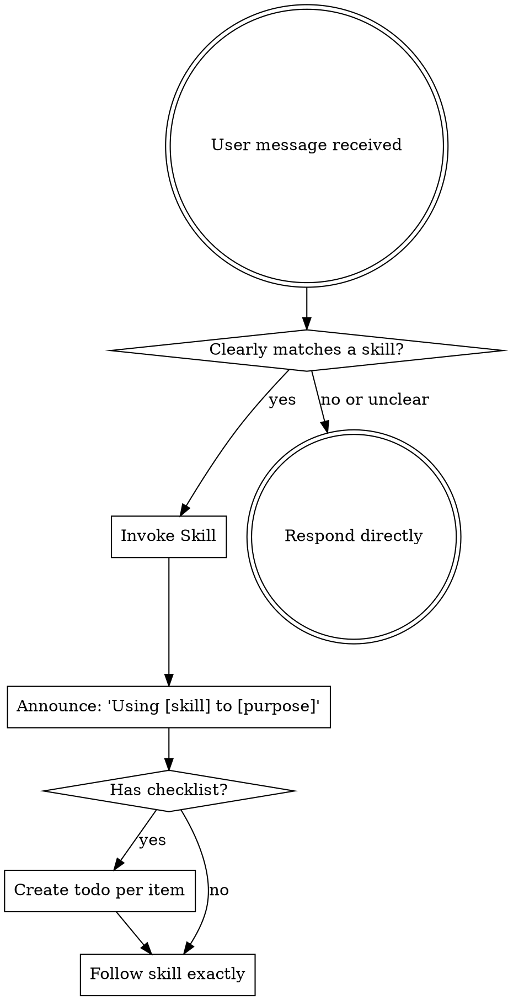

## How to Access Skills

Read the relevant SKILL.md file from the `skills/` directory in this project. When you invoke a skill, its content is loaded and presented to you -- follow it directly.

# Using Skills

## The Rule

**Invoke skills when they are clearly relevant to the current task, or when the user explicitly requests a skill.** Skills are tools to help you work better, not bureaucratic checkpoints that must run on every interaction.

## When to Invoke Skills

Invoke a skill when:
- The user explicitly requests it (e.g., `/sr-brainstorming`, `/sr-tdd`)
- The task clearly and unambiguously matches a skill's purpose
- You are about to start a major piece of work that benefits from structure

## When NOT to Invoke Skills

Do **NOT** invoke skills for:
- Simple questions or conversations
- Committing code, creating PRs, or routine git operations
- Quick fixes, typo corrections, or small edits
- Continuing work that is already in progress with clear direction
- Tasks where the user has given specific, detailed instructions
- Reading files, exploring codebases, or gathering information
- Any task the user clearly wants done directly without ceremony

## Skill Routing Table (Super-Ralph)

All Super-Ralph skills use the `sr-` prefix. Use the exact skill names below.

| Task Type | Skill to Invoke | When |
|-----------|----------------|------|
| New feature, creative work | **sr-brainstorming** | Before design or implementation |
| Create implementation plan | **sr-writing-plans** | After design is approved |
| Any implementation work | **sr-test-driven-development** | Features, bugs, refactoring |
| Bug, test failure, error | **sr-systematic-debugging** | Before proposing any fix |
| Claiming work is done | **sr-verification-before-completion** | Before commit or completion claim |
| Execute plan (same session) | **sr-subagent-driven-development** | Independent tasks with subagents |
| Execute plan (new session) | **sr-executing-plans** | Batch execution with checkpoints |
| After completing tasks | **sr-requesting-code-review** | Dispatch code-reviewer subagent |
| Received review feedback | **sr-receiving-code-review** | Evaluate feedback critically |
| All tasks done, integrate | **sr-finishing-a-development-branch** | Merge, PR, or cleanup |
| Need isolated workspace | **sr-using-git-worktrees** | Feature isolation |
| 3+ independent failures | **sr-dispatching-parallel-agents** | Parallel agents |
| Creating/editing skills | **sr-writing-skills** | TDD for skills |

**Workflow chains:**
- "Build a feature" → **sr-brainstorming** → **sr-writing-plans** → **sr-test-driven-development**
- "Fix this bug" → **sr-systematic-debugging** → **sr-test-driven-development**
- "Is this done?" → **sr-verification-before-completion**
- "Review this code" → **sr-requesting-code-review**

## Skill Priority

When multiple skills could apply, use this order:

1. **Process skills first** (sr-brainstorming, sr-systematic-debugging) - these determine HOW to approach the task
2. **Implementation skills second** (sr-test-driven-development, sr-writing-plans) - these guide execution

## Skill Types

**Rigid** (sr-test-driven-development, sr-systematic-debugging): Follow exactly. Don't adapt away discipline.

**Flexible** (patterns): Adapt principles to context.

The skill itself tells you which.

## Enforcement Rules (During Active Ralph Loops)

1. **ANNOUNCE before using:** Always say "I'm using sr-[skill-name] to [purpose]" before following a skill.
2. **Verify before claiming completion:** Before any claim that work is done, run the actual commands and read the output.
3. **Investigate before fixing:** If something is broken, complete root cause investigation before suggesting any fix.
4. **ONE fix at a time:** Never bundle multiple fixes. Test each fix individually.
5. **Evidence before assertions:** Every success claim requires command output proving it.

## Red Flags

Stop and reassess if you catch yourself:
- Invoking skills for simple questions, quick fixes, or routine git operations
- Skipping skill invocation when the task clearly matches a skill's purpose
- Chaining multiple skills without user awareness (announce each one)
- Treating skills as optional when they are marked REQUIRED in a workflow
- Overriding user instructions with skill ceremony

## Related Skills

- **sr-brainstorming**: Design exploration before implementation
- **sr-writing-plans**: Create implementation plans from designs
- **sr-test-driven-development**: Core implementation methodology
- **sr-systematic-debugging**: Root cause investigation for bugs
- **sr-verification-before-completion**: Evidence-based completion claims

## User Instructions

When the user gives direct, specific instructions (e.g., "add this function", "fix this bug", "commit this"), execute them directly. Skills complement user instructions; they don't override them or add unnecessary ceremony.
